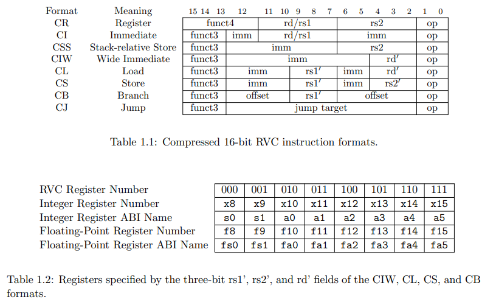

# Building a toy RVC CPU

ShanghaiTech 2024 Spring Project 2

author: Gubin Hu

## Quick Start
You can run the code below to start logisim:
```java
java -jar logisim-evolution.jar 
```
Then, you should open project_2_2.circ in logisim, then you will see things like this:


## Introduction

This excerpt from the RISC-V User-Level ISA Specification describes the current draft proposal for the RISC-V standard compressed instruction set extension, named “C”, which reduces static and dynamic code size by adding short 16-bit instruction encodings for common operations. The C extension can be added to any of the base ISAs (RV32, RV64, RV128), and we use the generic term “RVC” to cover any of these. Typically, 50%–60% of the RISC-V instructions in a program can be replaced with RVC instructions, resulting in a 25%–30% code-size reduction. In this project, we will build a CPU that solely supports some of the RVC instructions.


### The Instruction Set

The instructions we implement are shown in the table below:

| Format | ISA  | OP[1:0] | Funct3 | Implementation                                |
|--------|------|---------|--------|-----------------------------------------------|
| CR     | add  | 10      | 100    | x[rd] = x[rd] + x[rs2]                      |
| CR     | mv   | 10      | 100    | x[rd] = x[rs2]                              |
| CI     | addi | 01      | 000    | x[rd] = x[rd] + sext(imm)                    |
| CI     | slli | 10      | 000    | x[rd] = x[rd] << uimm                       |
| CI     | li   | 01      | 010    | x[rd] = sext(imm)                           |
| CI     | lui  | 01      | 011    | x[rd] = sext(imm[17:12] << 12)             |
| CI     | nop  | 01      | 000    | None                                        |
| CSS    | swsp | 10      | 110    | M[x[2] + uimm][31:0] = x[rs2]              |
| CIW    | addi4spn | 00 | 000    | x[8+rd'] = x[2] + nzuimm                    |
| CL     | lw   | 00      | 010    | x[8+rd'] = sext(M[x[8+rs1'] + uimm][31:0]) |
| CS     | sw   | 00      | 110    | M[x[8+rs1'] + uimm][31:0] = x[8+rs2']      |
| CB     | beqz | 01      | 110    | if (x[8+rs1'] == 0) pc += sext(offset)     |
| CJ     | j    | 01      | 101    | pc += sext(offset)                          |
| CR     | jr   | 10      | 100    | pc = x[rs1]                                |

A detailed description of compressed instruction formats is provided in [The RISC-V Compressed Instruction Set Manual, Version 1.9](https://riscv.org/wp-content/uploads/2015/11/riscv-compressed-spec-v1.9.pdf). 

### Instruction Formats




Table 1.1 shows the eight compressed instruction formats. CR, CI, and CSS can use any of the 32 RVI registers, but CIW, CL, CS, and CB are limited to use only 8 of them, which are registers x8 to x15 listed in Table 1.2. 


#### CR Format

| CR  | FUNCT4 | RD/RS1 | RS2 | OPCODE |
| --- | --- | --- | --- | --- |
| **Bits** | 4   | 5   | 5   | 2   |
| **C.ADD** | 1001 | dest≠ 0 | src≠ 0 | 10  |
| **C.MV** | 1000 | dest≠ 0 | src≠ 0 | 10  |
| **C.JR** | 1000 | src≠ 0 | 0   | 10  |

#### CI Format

| CI  | FUNCT3 | IMM | RD/RS1 | IMM | OPCODE |
| --- | --- | --- | --- | --- | --- |
| **Bits** | 3   | 1   | 5   | 5   | 2    |
| **C.LI**  | 010  | imm[5] | dest≠ 0 | imm[4:0] | 01 |
| **C.LUI** | 011  | nzimm[17] | dest≠{0,2} | nzimm[16:12] | 01 |
| **C.ADDI** | 000 | nzimm[5] | dest≠ 0 | nzimm[4:0] | 01 |
| **C.SLLI** | 000 | shamt[5] | dest≠ 0 | shamt[4:0] | 10 |

#### CL Format

| CL  | FUNCT3 | IMM | RS1' | IMM | RD' | OPCODE |
| --- | --- | --- | --- | --- | --- | --- |
| **Bits** | 3   | 3   | 3   | 2   | 3   | 2     |
| **C.LW**  | 010  | offset[5:3] | base | offset[2|6] | dest | 00 |

#### CS Format

| CS  | FUNCT3 | IMM | RS1' | IMM | RS2' | OPCODE |
| --- | --- | --- | --- | --- | --- | --- |
| **Bits** | 3   | 3   | 3   | 2   | 3    | 2     |
| **C.SW**  | 110  | offset[5:3] | base | offset[2|6] | src | 00 |

#### CSS Format

| CSS | FUNCT3 | IMM | RS2' | OPCODE |
| --- | --- | --- | --- | --- |
| **Bits** | 3   | 6   | 5   | 2    |
| **C.SWSP** | 110 | offset[5:2|7:6] | src | 10 |

#### CIW Format

| CIW | FUNCT3 | IMM | rd' | OPCODE |
| --- | --- | --- | --- | --- |
| **Bits** | 3   | 8   | 3   | 2    |
| **C.ADDI4SPN** | 000 | zimm[5:4|9:6|2|3] | dest | 00 |

#### CJ Format

| CJ  | FUNCT3 | JUMP TARGET | OPCODE |
| --- | --- | --- | --- |
| **Bits** | 3   | 11 | 2   |
| **C.J**  | 101  | offset[11|4|9:8|10|6|7|3:1|5] | 01 |

#### CB Format

| CB  | FUNCT3 | IMM | RD'/RS1' | IMM | OPCODE |
| --- | --- | --- | --- | --- | --- |
| **Bits** | 3   | 3   | 3   | 5   | 2    |
| **C.BEQZ** | 110 | offset[8|4:3] | src | offset[7:6|2:1|5] | 01 |

### TOP I/O

The inputs and outputs of the top-level are fixed in the `TOP` circuit, shown below.

| Type | signal | bit width | description |
| --- | --- | --- | --- |
| input | clk | 1   | clock |
| input | rst | 1   | reset |
| input | inst | 16  | RVC instruction |
| input | mem\_dout | 32  | data from memory |
| input | current\_pc | 32  | current pc value |
| output | mem\_wen | 1   | memory write enable |
| output | mem\_din | 32  | data written to memory |
| output | mem\_ren | 1   | memory read enable |
| output | mem\_addr | 32  | address of memory |
| output | control\_en | 1   | enable writing value to pc |
| output | control\_pc | 32  | value written to pc |
| output | wb\_en | 1   | regfile write enable |
| output | wb\_addr | 5   | address written to regfile |
| output | wb\_data | 32  | data written to regfile |


### Fetch

The **Fetch module** assumes that:

- The instruction memory is halfword-addressable, i.e., each address refers to a 16-bit memory space.
- During each clock cycle, an instruction is fetched from the address stored in the program counter.
- The address value in the program counter increments by one each clock cycle to fetch the next instruction without considering branch or jump.


